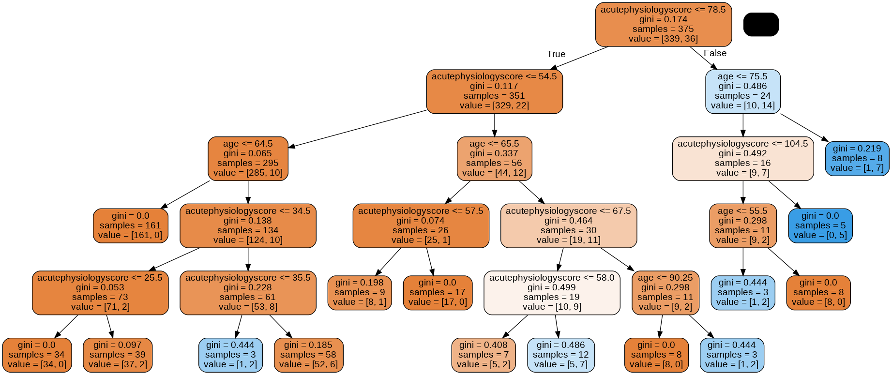
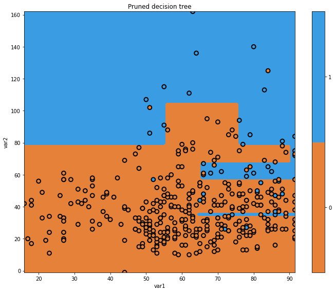

## Increasing the depth of our tree

In the previous episode we created a very simple decision tree. Let's see what happens when we introduce new decision points by increasing the depth.

```python
# train model
mdl = tree.DecisionTreeClassifier(max_depth=5)
mdl = mdl.fit(x_train, y_train)

# plot tree
plt.figure(figsize=[10,8])
glowyr.plot_model_pred_2d(mdl, x_train, y_train, title="Decision tree (depth 5)")
```

{: width="600px"}

Now our tree is more complicated! We can see a few vertical boundaries as well as the horizontal one from before. Some of these we may like, but some appear unnatural. Let's look at the tree itself.

```python
graph = glowyr.create_graph(mdl,feature_names=features)
Image(graph.create_png())
```

{: width="900px"}

## Overfitting

Looking at the tree, we can see that there are some very specific rules. Consider our patient aged 65 years with an acute physiology score of 87. From the top of the tree, we would work our way down:

- acutePhysiologyScore <= 78.5? No.
- acutePhysiologyScore <= 106.5? Yes.
- age <= 75.5? Yes
- age <= 66. Yes.
- age <= 62.5? No.

This leads us to our single node with a gini impurity of 0. Having an entire rule based upon this one observation seems silly, but it is perfectly logical at the moment. The only objective the algorithm cares about is minimizing the gini impurity. 

Overfitting is a problem that occurs when our algorithm is too closely aligned to our training data. The result is that the model may not generalise well to "unseen" data, such as observations for new patients entering a critical care unit. This is where "pruning" comes in.

## Pruning

Let's prune the model and look again.

```python
mdl = glowyr.prune(mdl, min_samples_leaf = 100)
graph = glowyr.create_graph(mdl,feature_names=features)
Image(graph.create_png())
```

{: width="900px"}

Above, we can see that our second tree is (1) smaller in depth, and (2) never splits a node with <= 10 samples. We can look at the decision surface for this tree:

```python
plt.figure(figsize=[10,8])
glowyr.plot_model_pred_2d(mdl, x_train, y_train, title="Pruned decision tree")
```

{: width="600px"}

Our pruned decision tree has a much more intuitive boundary, but does make some errors. We have reduced our performance in an effort to simplify the tree. This is the classic machine learning problem of trading off complexity with error.

Note that, in order to do this, we "invented" the minimum samples per leaf node of 10. Why 10? Why not 5? Why not 20? The answer is: it depends on the dataset. Heuristically choosing these parameters can be time consuming, and we will see later on how gradient boosting elegantly handles this task.

## Decision trees have high "variance"

Decision trees have high "variance". In this context, variance refers to a property of some models to have a wide range of performance given random samples of data. Let's take a look at randomly slicing the data we have to see what that means.

```python
import numpy as np
np.random.seed(123)

fig = plt.figure(figsize=[12,3])

for i in range(3):
    ax = fig.add_subplot(1,3,i+1)

    # generate indices in a random order
    idx = np.random.permutation(x_train.shape[0])
    
    # only use the first 50
    idx = idx[:50]
    X_temp = x_train.iloc[idx]
    y_temp = y_train.values[idx]
    
    # initialize the model
    mdl = tree.DecisionTreeClassifier(max_depth=5)
    
    # train the model using the dataset
    mdl = mdl.fit(X_temp, y_temp)
    txt = f'Random sample {i+1}'
    glowyr.plot_model_pred_2d(mdl, X_temp, y_temp, title=txt)
```

{: width="900px"}

Above we can see that we are using random subsets of data, and as a result, our decision boundary can change quite a bit. As you could guess, we actually don't want a model that randomly works well and randomly works poorly, so you may wonder why this is useful.

The trick is that by combining many of instances of "high variance" classifiers (decision trees), we can end up with a single classifier with low variance. There is an old joke: two farmers and a statistician go hunting. They see a deer: the first farmer shoots, and misses to the left. The next farmer shoots, and misses to the right. The statistician yells "We got it!!".

While it doesn't quite hold in real life, it turns out that this principle does hold for decision trees. Combining them in the right way ends up building powerful models.



