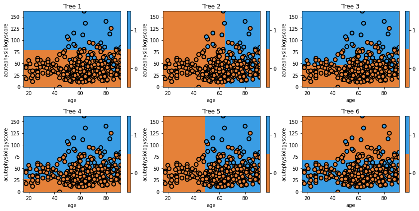
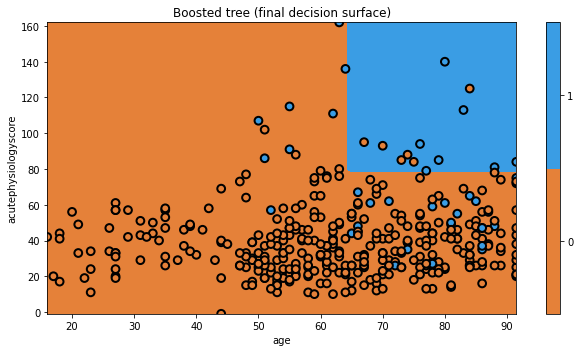

## Boosting

In the previous episode, we demonstrated that decision trees may have high "variance". Their performance can vary widely given different samples of data. An algorithm that performs somewhat poorly at a task - such as simple decision tree - is sometimes referred to as a "weak learner".

The premise of boosting is the combination of many weak learners to form a single "strong" learner. In a nutshell, boosting involves building a models iteratively. At each step we focus on the data on which we performed poorly.

In our context, the first step is to build a tree using the data. Next, we look at the data that we misclassified, and re-weight the data so that we really wanted to classify those observations correctly, at a cost of maybe getting some of the other data wrong this time. Let's see how this works in practice.

```python
from sklearn import ensemble

# build models with a single split
clf = tree.DecisionTreeClassifier(max_depth=1)
mdl = ensemble.AdaBoostClassifier(base_estimator=clf,n_estimators=6)
mdl = mdl.fit(x_train.values, y_train.values)

# plot each individual decision tree
fig = plt.figure(figsize=[12,6])
for i, estimator in enumerate(mdl.estimators_):
    ax = fig.add_subplot(2,3,i+1)
    txt = 'Tree {}'.format(i+1)
    glowyr.plot_model_pred_2d(estimator, x_train, y_train, title=txt)
```

{: width="900px"}

> ## Question
> A) Does the first tree in the collection (the one in the top left) look familiar to you? Why?      
> > ## Answer
> > A) We have seen the tree before. It is the very first tree that we built, which makes sense: it is using the entire dataset with no special weighting.   
> {: .solution}
{: .challenge} 

In the second tree we can see the model shift. It misclassified several observations in class 1, and now these are the most important observations. Consequently, it picks the boundary that, while prioritizing correctly classifies these observations, still tries to best classify the rest of the data too. The iteration process continues until the model may be creating boundaries to capture just one or two observations.

One important point is that each tree is weighted by its global error. So, for example, Tree 6 would carry less weight in the final model. It is clear that we wouldn't want Tree 6 to carry the same importance as Tree 1, when Tree 1 is doing so much better overall. It turns out that weighting each tree by the inverse of its error is a pretty good way to do this.

Let's look at the decision surface of the final ensemble.

```python
# plot the final prediction
plt.figure(figsize=[9,5])
txt = 'Boosted tree (final decision surface)'
glowyr.plot_model_pred_2d(mdl, x_train, y_train, title=txt)
```

{: width="900px"}

And that's AdaBoost! There are a few tricks we have glossed over here, but you understand the general principle. We modified the data to focus on hard to classify observations. We can imagine this as a form of data resampling for each new tree. 

For example, say we have three observations: A, B, and C, [A, B, C]. If we correctly classify observations [A, B], but incorrectly classify C, then AdaBoost involves building a new tree that focuses on C. 

Equivalently, we could say AdaBoost builds a new tree using the dataset [A, B, C, C, C], where we have intentionally repeated observation C 3 times so that the algorithm thinks it is 3 times as important as the other observations. Makes sense?

Now we'll move on to a different approach that also involves manipulating data to build new trees.



