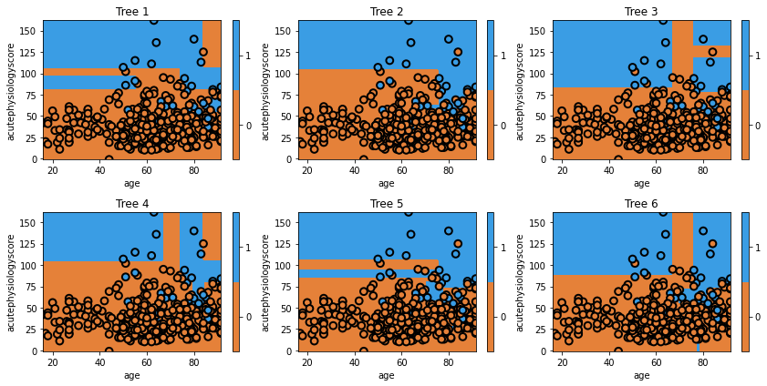
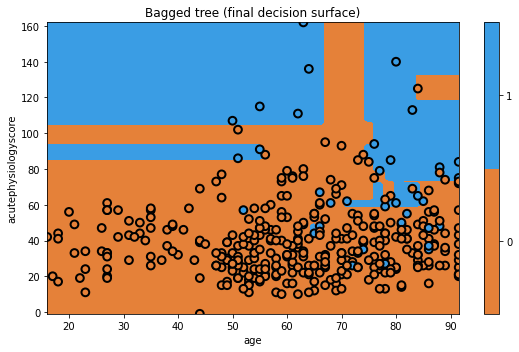

## Boostrap aggregation ("Bagging")

Bootstrap aggregation, or "Bagging", is another form of ensemble learning where we aim to build a single good model by combining many models together. With AdaBoost, we modified the data to focus on hard to classify observations. We can imagine this as a form of resampling the data for each new tree. For example, say we have three observations: A, B, and C, [A, B, C]. If we correctly classify observations [A, B], but incorrectly classify C, then AdaBoost involves building a new tree that focuses on C. Equivalently, we could say AdaBoost builds a new tree using the dataset [A, B, C, C, C], where we have intentionally repeated observation C 3 times so that the algorithm thinks it is 3 times as important as the other observations. Makes sense?

Bagging involves the same approach, except we don't selectively choose which observations to focus on, but rather we randomly select subsets of data each time. As you can see, while this is a similar process to AdaBoost, the concept is quite different. Whereas before we aimed to iteratively improve our overall model with new trees, we now build trees on what we hope are independent datasets.

Let's take a step back, and think about a practical example. Say we wanted a good model of heart disease. If we saw researchers build a model from a dataset of patients from their hospital, we would be happy. If they then acquired a new dataset from new patients, and built a new model, we'd be inclined to feel that the combination of the two models would be better than any one individually. This exact scenario is what bagging aims to replicate, except instead of actually going out and collecting new datasets, we instead use bootstrapping to create new sets of data from our current dataset. If you are unfamiliar with bootstrapping, you can treat it as "magic" for now (and if you are familiar with the bootstrap, you already know that it is magic).

Let's take a look at a simple bootstrap model.

```python
np.random.seed(321)
clf = tree.DecisionTreeClassifier(max_depth=5)
mdl = ensemble.BaggingClassifier(base_estimator=clf, n_estimators=6)
mdl = mdl.fit(x_train.values, y_train.values)

fig = plt.figure(figsize=[12,6])
for i, estimator in enumerate(mdl.estimators_):    
    ax = fig.add_subplot(2,3,i+1)
    txt = 'Tree {}'.format(i+1)
    glowyr.plot_model_pred_2d(estimator, x_train, y_train, title=txt)
```

{: width="900px"}

We can see that each individual tree is quite variable. This is a result of using a random set of data to train the classifier.

```python
# plot the final prediction
plt.figure(figsize=[8,5])
txt = 'Bagged tree (final decision surface)'
glowyr.plot_model_pred_2d(mdl, x_train, y_train, title=txt)
```

{: width="900px"}

Not bad! Of course, since this is a simple dataset, we are not seeing that many dramatic changes between different models. Don't worry, we'll quantitatively evaluate them later.

Next up, a minor addition creates one of the most popular models in machine learning.



